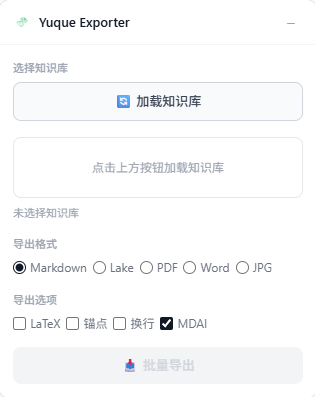
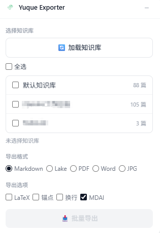

# 语雀知识库批量导出

[](https://chrome.google.com/webstore)

Chrome 浏览器扩展，批量导出语雀知识库文档。
安装即用，无需手动获取 Token 或 API 密钥 —— 扩展直接从页面读取认证信息，省去一切配置步骤。

语雀原生只支持单篇手动导出。这个扩展让你可以一键批量导出整个知识库的所有文档。

## 支持的导出格式

扩展调用语雀官方导出接口，支持全部五种格式：

| 格式 | 说明 | 扩展名 |
| ------ | ------ | -------- |
| Markdown | 标准 Markdown | `.md` |
| Lake | 语雀原生格式，完整保留语雀特有语法 | `.lake` |
| Word | Microsoft Word 文档 | `.docx` |
| PDF | 便携式文档格式 | `.pdf` |
| JPG | 图片格式 | `.jpg` |

> **注意**：导出由语雀官方接口完成，格式和质量与语雀原生导出一致。本扩展只做了批量自动化。

## 安装

从源码加载（开发者模式）：

1. 克隆项目到本地
2. 打开 `chrome://extensions/`（Edge 用 `edge://extensions/`）
3. 开启右上角「开发者模式」
4. 点击「加载已解压的扩展程序」
5. 选择项目根目录

> Chrome Web Store 上架中，后续可通过商店直接安装。

## 使用

### 界面

打开语雀页面后，右上角会出现浮动的导出面板：

| 初始状态 | 加载知识库后 |
| :---: | :---: |
|  |  |

面板可拖拽移动，点击 `-` 按钮可折叠为小图标。在语雀知识库内部页面，面板还会显示「导出当前文档」按钮，方便单篇导出。

### 批量导出

1. 打开任意语雀页面（需要已登录语雀账号）
2. 点击面板中的「加载知识库」按钮
3. 勾选要导出的知识库，支持全选
4. 选择导出格式
5. 根据需要调整导出选项
6. 点击「批量导出」

导出过程中面板会显示进度，完成后浏览器自动下载文件。

### 导出选项

**Markdown 格式可选参数：**

| 选项 | 说明 |
| ------ |------ |
| LaTeX | 将 LaTeX 公式导出为 Markdown 语法 |
| 锚点 | 保留语雀的锚点链接 |
| 换行 | 保留语雀的换行格式 |
| MDAI | 导出 PlantUML 等额外卡片内容（默认开启） |

**PDF 格式可选参数：**

| 选项 | 说明 |
| ------ | ------ |
| 导出大纲 | 在 PDF 中包含文档大纲 |

### 导出目录结构

根据语雀知识库的大纲（TOC）自动组织目录：

```text
知识库名称/
├── 文档1.md
├── 章节标题/
│   ├── 文档2.md
│   └── 文档3.md
└── 文档4.md
```

## 技术实现

基于 Chrome Extension Manifest V3，纯 JavaScript，无构建步骤。

```text

.
├── manifest.json      # 扩展配置
├── background.js      # Service Worker，批量导出逻辑
├── content.js         # Content Script，Cookie 代理
├── ui.js              # 浮动面板 UI
├── popup.html         # 工具栏弹窗（提示页）
└── icons/             # 扩展图标
```

### 组件通信

三个组件通过 `chrome.runtime.sendMessage` 通信：

- **Content Script** — 注入语雀页面，读取 `document.cookie`
- **Service Worker** — 获取文档列表、调用导出 API、管理下载
- **UI Panel** — 知识库选择、格式配置、进度展示

### 工作原理

语雀使用 httpOnly Cookie，`chrome.cookies` API 无法访问。扩展通过 Content Script 直接读 `document.cookie`，通过消息传递交给 Service Worker，后者携带 Cookie 调用语雀 API。

1. 获取用户知识库列表 → `GET /api/mine/book_stacks`
2. 对每个选中的知识库，获取文档大纲（解析页面中 `window.appData`）
3. 遍历文档列表，逐个调用导出接口 → `POST /api/docs/{id}/export`
4. 等待语雀后台生成完成后下载文件
5. 通过 `chrome.downloads.download()` 保存，保持目录结构

## 常见问题

<details>
<summary>导出失败或 Cookie 为空？</summary>

确认已在当前浏览器登录语雀（`https://www.yuque.com`）。扩展依赖页面 Cookie 进行 API 认证。
</details>

<details>
<summary>可以导出私有知识库吗？</summary>

可以。只要你的账号有权限访问，就能导出。
</details>

<details>
<summary>为什么导出的是 .lake 格式而不是标准 Markdown？</summary>

Lake 是语雀原生格式，如果你需要标准 Markdown，在格式中选择 "Markdown" 即可。
</details>

## 免责声明

本扩展仅供个人学习使用。请遵守语雀服务条款，勿用于商业用途或侵犯他人权益。

## 致谢

感谢语雀团队提供的文档平台。
